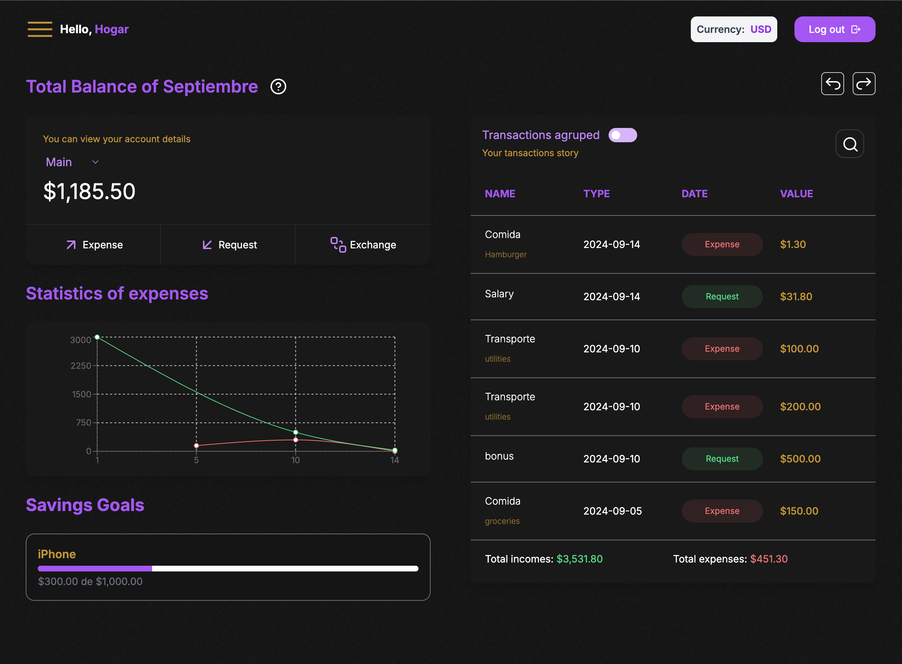

## Bienvenido a Flow Finance

## Características principales

- **Administra tus finanzas**: Gestiona tu dinero, registrando tus gastos recurrentes y gastos hormigas para asi determinar donde termina tu dinero y llevar un mejor control de el.
- **Tus deudas tambien son importantes para registrar**: La mayoria de las personas tienen deudas y no es un secreto, registralas, automatiza el dia del pago para que no se te pase registrar alguno, animate 💛.

### Capturas de pantalla de la Landing Page

  

[stars-url]: https://github.com/KevBT/flow-finance/stargazers

### Para ejecutar el proyecto localmente con Docker

1. Clona el repositorio: `git clone https://github.com/KevBT/flow-finance.git`
2. Navega al directorio del proyecto: `cd flow-finance`
3. Instala las dependencias: `docker compose build`
4. Ejecuta el proyecto: `docker compose up -d`
